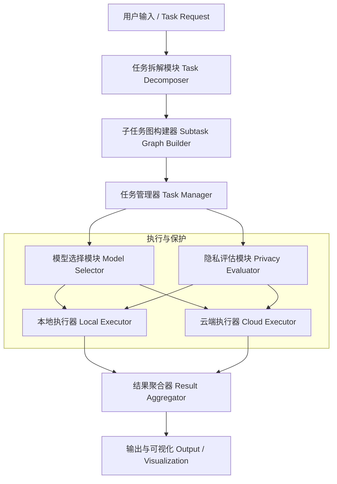

# 🧠 多层级任务处理与隐私保护框架设计说明书

本项目旨在构建一个通用的 **智能任务处理框架（Intelligent Task Processing Framework）**，能够自动拆解复杂任务，并根据任务类型、隐私敏感度和计算复杂度，动态选择在本地或云端执行子任务。框架支持多模态输入（文本、图像、结构化数据等），适用于以下场景：

- 🤖 对话系统任务（意图识别、情感分析、知识检索、回复生成）
- 📄 文档摘要与信息抽取
- 🖼️ 图像理解与标注
- 🎮 流程规划类游戏任务（如StarDojo、MineDojo环境）

该框架旨在实现 **高效、可扩展且隐私友好的任务处理**，兼顾计算性能与数据安全。

---

## 🧩 系统总体架构



---

## 🧠 核心模块说明

| 模块 | 功能 |
|------|------|
| **Task Decomposer** | 使用规则或LLM将任务拆分为若干子任务（可采用LangChain或TaskWeaver） |
| **Privacy Evaluator** | 评估任务是否涉及隐私信息，输出风险等级（高/中/低） |
| **Model Selector** | 根据复杂度与风险动态决定使用本地或云端模型 |
| **Local Executor** | 调用本地模型或工具（spaCy, Rasa, TinyLlama 等）执行任务 |
| **Cloud Executor** | 调用云端大模型（GPT-4, Claude, Gemini 等）执行高复杂度任务 |
| **Data Packager** | 对输入进行封装、脱敏或加密（差分隐私或同态加密） |
| **Result Aggregator** | 聚合所有子任务结果并进行上下文整合 |

---

## ⚙️ 执行逻辑示例

```python
def process_task(task):
    subtasks = decompose(task)
    results = {}

    for st in subtasks:
        risk = evaluate_privacy(st)
        complexity = estimate_difficulty(st)
        score = alpha * complexity + beta * risk

        if score < THRESH_LOCAL:
            result = run_local(st)
        elif score < THRESH_SANITIZED:
            safe_st = sanitize_data(st)
            result = run_cloud(safe_st)
        else:
            result = run_secure_container(st)

        results[st.name] = result

    return aggregate_results(results)
```

---

## 🧰 推荐技术栈

| 功能模块 | 推荐工具/框架 |
|-----------|----------------|
| 任务拆解 | LangChain, TaskWeaver |
| 任务依赖管理 | NetworkX |
| 本地模型 | spaCy, Rasa NLU, TinyLlama, DistilBERT |
| 云端模型 | OpenAI GPT-4, Claude 3, Gemini 1.5, DeepSeek |
| 隐私计算 | PySyft, PyDP, TenSEAL, Pyfhel |
| 数据脱敏 | Microsoft Presidio, Faker |
| 调度执行 | Celery, Ray, asyncio |

---

## 🚀 应用场景

- **对话系统任务**：低风险任务使用本地模型；复杂多轮任务可调用云端LLM。  
- **文档摘要与内容提炼**：段落聚类 → 主题提取 → 摘要生成。  
- **图像理解与标注**：本地CV模型（YOLOv8）+ 云端视觉LLM（Gemini Vision）。  
- **规划类游戏或模拟环境（StarDojo）**：状态解析 → 任务规划 → 动作执行。  

---

## 🧩 未来优化方向

1. 🌐 **多Agent协作机制**：借鉴 AutoGen、Voyager 实现子任务间通信。  
2. 🔐 **隐私自适应学习**：动态调整隐私保护级别以平衡性能与安全。  
3. ⚙️ **统一接口标准化**：抽象本地与云端API接口，提高可扩展性。  
4. 📊 **评估指标体系**：结合任务成功率、延迟、隐私泄露风险等多维度评估框架性能。  

---

## 📚 参考文献

- Tan et al., *StarDojo: Benchmarking Open-Ended Behaviors of Agentic Multimodal LLMs*, arXiv:2507.07445v2, 2025.  
- Fan et al., *MineDojo: Building Open-Ended Embodied Agents with Internet-Scale Knowledge*, NeurIPS 2022.  
- Wu et al., *AutoGen: Enabling Next-Gen LLM Applications through Multi-Agent Conversation*, 2023.  
- Yang et al., *Federated Learning: Challenges, Methods, and Future Directions*, IEEE TKDE, 2019.  
- Dwork, C. *Differential Privacy*, ICALP 2006.  
- Cheon et al., *A Decade of Fully Homomorphic Encryption*, IACR 2020.  
