# 🧠 智能任务处理与隐私保护框架

[](https://www.python.org/downloads/)
[](https://opensource.org/licenses/MIT)

一个生产级的 **智能任务处理框架（Privacy-Aware Task Processing Framework）**，能够自动拆解复杂任务，并根据隐私敏感度和计算复杂度，动态选择执行策略。框架支持同步/异步执行、任务依赖管理、数据脱敏和多种执行模式。

## ✨ 核心特性

- 🔄 **智能任务拆解**：自动将复杂任务分解为可并行执行的子任务
- 🔒 **隐私风险评估**：基于正则模式检测敏感信息（身份证、手机号、邮箱等）
- 🎯 **动态模型选择**：根据复杂度和隐私风险智能选择执行模式
- ⚡ **异步并行执行**：支持 asyncio 并发执行，可配置最大并发数
- 📊 **任务依赖管理**：基于 NetworkX 的 DAG 图管理任务依赖关系
- 🛡️ **数据脱敏保护**：自动识别并脱敏敏感数据后再发送到云端
- 🔐 **多执行模式**：本地执行、云端执行、脱敏云端执行、安全容器执行
- 📈 **结果聚合**：智能聚合多个子任务结果并生成摘要

## 🎯 适用场景

- 📄 **文档处理**：摘要生成、信息抽取、内容分析
- � **对话系统**：意图识别、情感分析、多轮对话
- 🔍 **数据分析**：包含敏感信息的数据处理任务
- 🤖 **智能代理**：复杂任务规划与执行

---

## 🏗️ 系统架构

```mermaid
graph TD
    A[用户任务请求] --> B[TaskManager/AsyncTaskManager]
    B --> C[TaskDecomposer 任务拆解]
    C --> D[SubtaskGraph 依赖图构建]
    D --> E[PrivacyEvaluator 隐私评估]
    E --> F[ModelSelector 模型选择]
    F --> G{执行模式选择}
    G -->|低风险低复杂度| H1[LocalExecutor]
    G -->|高复杂度| H2[CloudExecutor]
    G -->|有敏感信息| H3[SanitizedCloudExecutor]
    G -->|高风险| H4[SecureExecutor]
    H1 --> I[ResultAggregator]
    H2 --> I
    H3 --> J[DataSanitizer 数据脱敏] --> I
    H4 --> I
    I --> K[聚合结果输出]
    
    style H3 fill:#ffe6e6
    style H4 fill:#ffcccc
    style J fill:#fff3cd
```



### 执行流程

1. **任务拆解**：将复杂任务分解为多个子任务
2. **依赖分析**：构建子任务依赖图（DAG）
3. **隐私评估**：检测敏感信息，计算隐私风险分数（0-1）
4. **复杂度估算**：基于文本长度和关键词评估任务复杂度
5. **模式选择**：综合评分 = 0.6 × 复杂度 + 0.4 × 隐私风险
6. **并行执行**：按依赖层级并行执行子任务
7. **结果聚合**：整合所有子任务结果

---

## 📦 核心模块

### 数据模型 (`privacy_framework/models/`)

| 模块 | 说明 |
|------|------|
| `Task` | 任务模型：描述、类型、状态、子任务列表 |
| `Subtask` | 子任务模型：名称、描述、隐私级别、执行模式、依赖关系 |
| `TaskType` | 任务类型枚举：GENERAL, DOCUMENT_SUMMARY, DATA_ANALYSIS |
| `ExecutionMode` | 执行模式枚举：LOCAL, CLOUD, SANITIZED_CLOUD, SECURE_CONTAINER |
| `PrivacyLevel` | 隐私级别枚举：LOW, MEDIUM, HIGH |

### 核心处理 (`privacy_framework/core/`)

| 模块 | 功能 |
|------|------|
| **TaskDecomposer** | 基于规则的任务拆解器，将复杂任务分解为3-5个子任务 |
| **PrivacyEvaluator** | 隐私风险评估器，使用正则表达式检测敏感信息（身份证、手机、邮箱、银行卡等） |
| **ModelSelector** | 模型选择器，计算综合分数并选择最优执行模式 |
| **SubtaskGraph** | 基于 NetworkX 的任务依赖图管理器，支持拓扑排序和分层执行 |
| **ResultAggregator** | 结果聚合器，整合子任务结果并生成摘要 |
| **TaskManager** | 同步任务管理器，协调所有模块完成任务处理 |
| **AsyncTaskManager** | 异步任务管理器，支持并发执行和依赖管理 |

### 执行器 (`privacy_framework/executors/`)

| 执行器 | 说明 |
|--------|------|
| **LocalExecutor** | 本地执行器，模拟本地模型处理 |
| **CloudExecutor** | 云端执行器，调用云端大模型 API |
| **SanitizedCloudExecutor** | 脱敏云端执行器，先脱敏再发送到云端 |
| **SecureExecutor** | 安全容器执行器，在隔离环境中执行高风险任务 |
| **AsyncExecutor** | 异步执行器，支持并发控制和批量执行 |

### 隐私保护 (`privacy_framework/privacy/`)

| 模块 | 功能 |
|------|------|
| **DataSanitizer** | 数据脱敏器，将敏感信息替换为占位符（[ID_CARD], [PHONE], [EMAIL]等） |

### 工具类 (`privacy_framework/utils/`)

| 模块 | 功能 |
|------|------|
| **Logger** | 基于 loguru 的日志系统 |
| **Config** | 配置管理器，支持 YAML 和环境变量 |

---

## 🚀 快速开始

### 安装

```bash
# 克隆项目
git clone <repository-url>
cd privacy_framework_project

# 安装依赖
pip install -r requirements.txt
```

### 基础使用

```python
from privacy_framework import TaskManager
from privacy_framework.models.task import TaskType

# 创建任务管理器
manager = TaskManager()

# 处理任务
result = manager.process_task(
    description="分析用户13800138000的消费行为并生成报告",
    task_type=TaskType.DATA_ANALYSIS
)

print(result)
```

### 异步执行

```python
from privacy_framework.core.async_task_manager import AsyncTaskManager
import asyncio

async def main():
    manager = AsyncTaskManager(max_concurrent=5)
    
    # 异步处理任务
    result = await manager.process_task_async(
        description="生成产品文档摘要并提取关键信息",
        task_type=TaskType.DOCUMENT_SUMMARY
    )
    
    print(result)

asyncio.run(main())
```

### 执行模式选择逻辑

```python
# 综合分数计算
score = 0.6 * complexity_score + 0.4 * privacy_risk_score

# 执行模式选择
if score < 0.4:
    mode = ExecutionMode.LOCAL  # 本地执行
elif score < 0.7:
    if privacy_risk_score > 0.5:
        mode = ExecutionMode.SANITIZED_CLOUD  # 脱敏后云端执行
    else:
        mode = ExecutionMode.CLOUD  # 直接云端执行
else:
    if privacy_risk_score > 0.7:
        mode = ExecutionMode.SECURE_CONTAINER  # 安全容器
    else:
        mode = ExecutionMode.SANITIZED_CLOUD  # 脱敏云端
```

---

## 🛠️ 技术栈

| 组件 | 技术选型 | 版本要求 |
|------|---------|----------|
| **核心语言** | Python | 3.11+ |
| **日志系统** | loguru | 0.7.0+ |
| **图处理** | NetworkX | 3.0+ |
| **数据验证** | Pydantic | 2.0+ |
| **配置管理** | PyYAML, python-dotenv | 6.0+, 1.0+ |
| **异步执行** | asyncio (内置) | - |
| **可视化** | matplotlib (可选) | 3.5.0+ |
| **云端API** | openai, anthropic (可选) | 1.0+, 0.18+ |

### 依赖说明

```txt
# 必需依赖
loguru>=0.7.0          # 日志
networkx>=3.0          # 任务图
pydantic>=2.0.0        # 数据验证
pyyaml>=6.0            # 配置文件
python-dotenv>=1.0.0   # 环境变量

# 可选依赖
matplotlib>=3.5.0      # 任务图可视化
openai>=1.0.0          # OpenAI API
anthropic>=0.18.0      # Anthropic API
```

---

## 📊 项目结构

```
privacy_framework_project/
├── privacy_framework/          # 核心框架
│   ├── models/                # 数据模型
│   │   ├── task.py           # Task, TaskType, TaskStatus
│   │   └── subtask.py        # Subtask, ExecutionMode, PrivacyLevel
│   ├── core/                 # 核心处理模块
│   │   ├── task_decomposer.py
│   │   ├── privacy_evaluator.py
│   │   ├── model_selector.py
│   │   ├── subtask_graph.py
│   │   ├── result_aggregator.py
│   │   ├── task_manager.py
│   │   └── async_task_manager.py
│   ├── executors/            # 执行器
│   │   ├── base_executor.py
│   │   ├── local_executor.py
│   │   ├── cloud_executor.py
│   │   ├── secure_executor.py
│   │   ├── sanitized_cloud_executor.py
│   │   └── async_executor.py
│   ├── privacy/              # 隐私保护
│   │   └── data_sanitizer.py
│   └── utils/                # 工具类
│       ├── logger.py
│       └── config.py
├── examples/                 # 示例代码
├── tests/                    # 测试用例
├── config/                   # 配置文件
├── main.py                   # 项目生成脚本
├── requirements.txt          # 依赖列表
└── README.md                # 本文档
```

## 💡 使用示例

### 示例1：简单文本分析

```python
from privacy_framework import TaskManager

manager = TaskManager()
result = manager.process_task("分析这段文本的情感倾向")
print(result['summary'])
```

### 示例2：包含敏感信息的任务

```python
# 自动检测并脱敏敏感信息
result = manager.process_task(
    "分析用户张三（身份证：110101199001011234）的信用记录"
)
# 框架会自动：
# 1. 检测到身份证号（隐私风险 HIGH）
# 2. 选择 SANITIZED_CLOUD 模式
# 3. 脱敏为："分析用户张三（身份证：[ID_CARD]）的信用记录"
# 4. 发送到云端处理
```

### 示例3：异步并行处理

```python
import asyncio
from privacy_framework.core.async_task_manager import AsyncTaskManager

async def process_multiple_tasks():
    manager = AsyncTaskManager(max_concurrent=3)
    
    tasks = [
        "生成产品介绍",
        "分析用户反馈",
        "提取关键信息"
    ]
    
    results = await asyncio.gather(*[
        manager.process_task_async(task) for task in tasks
    ])
    
    return results

asyncio.run(process_multiple_tasks())
```  

---

## 🔧 配置说明

### 环境变量配置

创建 `.env` 文件：

```bash
# 云端 API 密钥（可选）
OPENAI_API_KEY=your_openai_key
ANTHROPIC_API_KEY=your_anthropic_key
```

### 配置文件 (`config/default_config.yaml`)

```yaml
privacy:
  threshold_low: 0.3    # 低风险阈值
  threshold_high: 0.7   # 高风险阈值

model_selection:
  complexity_weight: 0.6  # 复杂度权重
  risk_weight: 0.4        # 风险权重
  local_threshold: 0.4    # 本地执行阈值
  sanitized_threshold: 0.7 # 脱敏阈值
```

## 🧪 测试

运行框架自带的测试：

```bash
python main.py
```

测试包括：
1. 简单文本分析任务
2. 包含敏感信息的任务（自动脱敏）
3. 文档摘要任务

## 🚧 未来优化方向

- [ ] **真实模型集成**：接入实际的本地模型（如 Llama, Qwen）和云端 API
- [ ] **增强隐私保护**：支持差分隐私、同态加密
- [ ] **性能监控**：添加任务执行时间、资源消耗监控
- [ ] **多Agent协作**：支持子任务间通信和协作
- [ ] **Web界面**：提供可视化的任务管理界面
- [ ] **单元测试**：完善 pytest 测试覆盖率
- [ ] **Docker部署**：容器化部署方案  

---

## 📚 参考文献

- Tan et al., *StarDojo: Benchmarking Open-Ended Behaviors of Agentic Multimodal LLMs*, arXiv:2507.07445v2, 2025.  
- Fan et al., *MineDojo: Building Open-Ended Embodied Agents with Internet-Scale Knowledge*, NeurIPS 2022.  
- Wu et al., *AutoGen: Enabling Next-Gen LLM Applications through Multi-Agent Conversation*, 2023.  
- Yang et al., *Federated Learning: Challenges, Methods, and Future Directions*, IEEE TKDE, 2019.  
- Dwork, C. *Differential Privacy*, ICALP 2006.  
- Cheon et al., *A Decade of Fully Homomorphic Encryption*, IACR 2020.  
